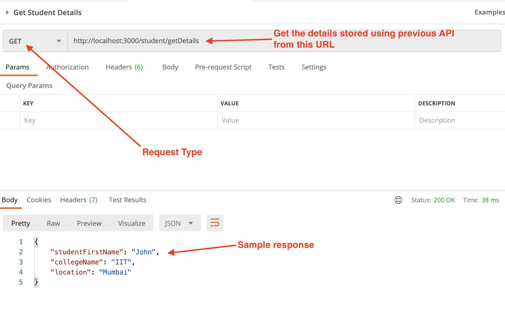

# Express Js assignment Board infinity

# Problem 1: 
Build an API to create and retrieve college student details

### Request URL:- http://localhost:8080/student/add
### Request Method:- POST
### Request JSON:- 
{
 "studentFirstName":"John",
 "collegeName": "IIT",
 "location": "Mumbai"
}
### Response JSON:-
{
 "result": "Success"
}

## Objective:- 
* Build an API which accepts the above parameters as a POST request using express.js
* Use Node.js fs module to store the received details JSON in a file. You can refer to the link below for the process:- https://www.geeksforgeeks.org/how-to-read-and-write-json-file-using-node-js/
*  Build a second API/route with which the stored details are sent back to client Refer 

### Request URL:- http://localhost:8080/student/getDetails
### Request Method:- GET
### Response JSON:-
{
 "studentFirstName":"John",
 "collegeName": "IIT",
 "location": "Mumbai"
}
### `node server`

Runs the server in the development mode.\
Open [http://localhost:8080](http://localhost:8080) to view it in your browser.

