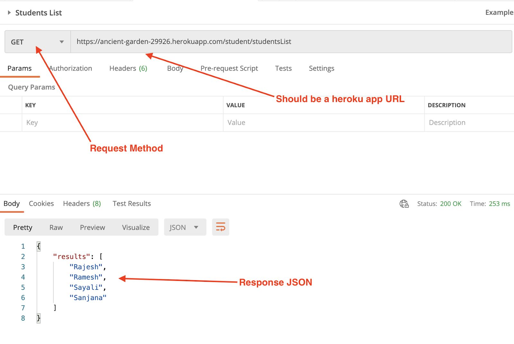

# Express Js assignment Board infinity

# Problem 2:-
Create an API using express.js and deploy it to Heroku

### Objective:-
* Create an API using express.js on your machine which return the below
response:-
  ### Request URL:- https://boardinfinity-assignment-expre.herokuapp.com/student/studentList
  ### Request Method:- GET
  
  ### Response JSON:-
  {
   "results": [
   "Rajesh",
   "Ramesh",
   "Sayali",
   "Sanjana"
   ]
  }

refer:-

* Create an account on Heroku:- https://www.heroku.com/ 
* Install Heroku CLI on your machine https://devcenter.heroku.com/articles/heroku-cli
*  Deploy your API to Heroku using below guide: https://devcenter.heroku.com/articles/deploying-nodejs
*   Share the Heroku URL and github repo of the project
### `node server`

Runs the server in the development mode.\
Open [http://localhost:8080](http://localhost:8080) to view it in your browser.

